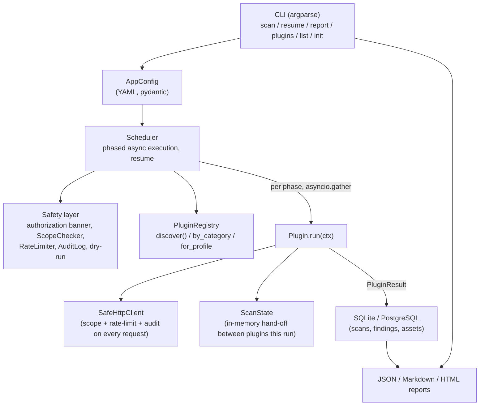

# Architecture

## Pipeline



## Plugin execution phases

There's no general dependency graph between plugins -- just a fixed phase
order, because only two dependency facts actually matter: everything wants
recon's discovered URLs/subdomains first, and the injection checks want the
parameters/forms that content-discovery and vuln-assessment found. Plugins
within a phase run concurrently (bounded by `rate_limit.concurrency`);
phases run strictly in order so each phase sees the previous phases'
`ScanState`.

```
recon -> inventory -> integrations -> passive_intel -> content_discovery
      -> vuln_assessment -> api_security -> auth_access -> cloud_infra -> injection
```

- **recon**: DNS/subdomain enumeration, HTTP fingerprinting, tech detection,
  robots/sitemap, endpoint discovery, historical URLs.
- **inventory**: one plugin (`recon.asset_inventory`) that summarises what
  recon found. Runs in its own phase specifically so it executes *after*
  every recon plugin has finished writing to `ScanState` -- plugins in the
  same phase run concurrently, so it can't be a recon plugin itself.
- **integrations**: optional external-tool adapters (nuclei, katana, httpx,
  subfinder, dnsx, naabu, gau, waybackurls). No-ops if the binary isn't
  installed.
- **passive_intel**: certificate transparency analysis (WHOIS/ASN/reputation
  are documented extension points, not implemented -- see
  `docs/plugin_development.md`).
- **content_discovery**: directory/file brute-force, parameter discovery,
  API endpoint identification, JS analysis, secret detection.
- **vuln_assessment**: security headers, TLS, misconfiguration, auth
  assessment, session management, CORS, CSP, cookies.
- **api_security**: OpenAPI/Swagger parsing, GraphQL introspection probe.
- **auth_access**: MFA-language heuristic (login-surface mapping, password
  policy, IDOR, and authorization-boundary checks are documented extension
  points -- they need credentials a default unauthenticated scan can't assume).
- **cloud_infra**: cloud storage references, CI/CD config exposure,
  container/orchestrator API exposure.
- **injection**: XSS/SQLi/CmdI/SSTI/path-traversal/XXE/open-redirect
  *indicators*. Off by default -- requires `safety.active_injection_probes: true`.

## Safety is structural, not a convention

Plugins never call `httpx`/`socket`/`subprocess` directly against the target
on the happy path -- they go through `SafeHttpClient` (HTTP),
`ctx.rate_limiter` (DNS/raw-socket probes), or `integrations.base.ToolAdapter`
(external binaries), each of which enforces scope, rate limiting, and the
audit log, and refuses to act at all when `safety.dry_run` is set. See
`SECURITY.md` for the full policy.

## Data model

`PluginResult` (`findings: list[Finding]`, `assets: list[Asset]`,
`errors: list[str]`) is the only thing a plugin hands back. The scheduler
persists it via `core.db.repository.Repository`, which is the sole boundary
between the pydantic transport models (`core.models`) and the SQLAlchemy ORM
schema (`core.db.models`) -- see `docs/database_schema.md`.
