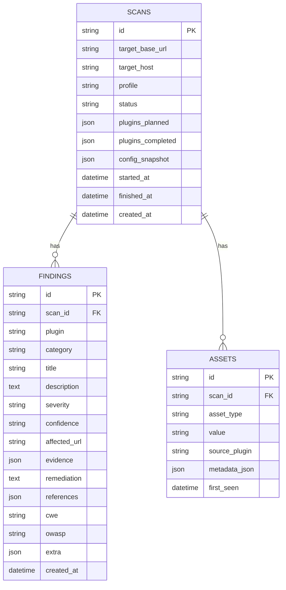

# Database Schema

SQLite by default (`sqlite:///websec_assess.db`); set `database.url` to a
`postgresql://` URL (and `pip install ".[postgres]"`) for PostgreSQL --
SQLAlchemy abstracts the rest, no schema changes needed either way.

## Why evidence/metadata are JSON columns, not join tables

Nothing queries findings or assets by a sub-field of their evidence or
metadata -- only by `scan_id`, `severity`, or `asset_type` (both indexed,
see `ix_findings_scan_severity` / `ix_assets_scan_type`). A normalised
evidence table would add joins with no query that benefits from them.

## Resume support

`scans.plugins_planned` and `scans.plugins_completed` are JSON arrays of
plugin names. `Repository.remaining_plugins(scan_id)` is just the set
difference -- `websec-assess resume <scan_id>` re-plans only those.
